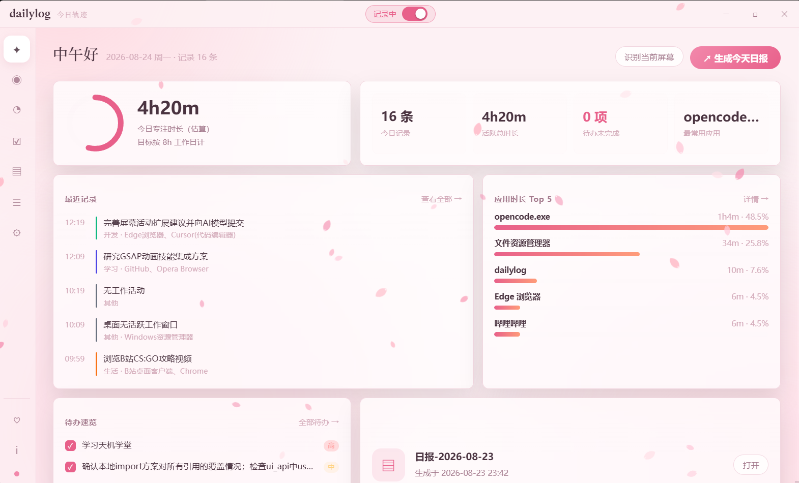
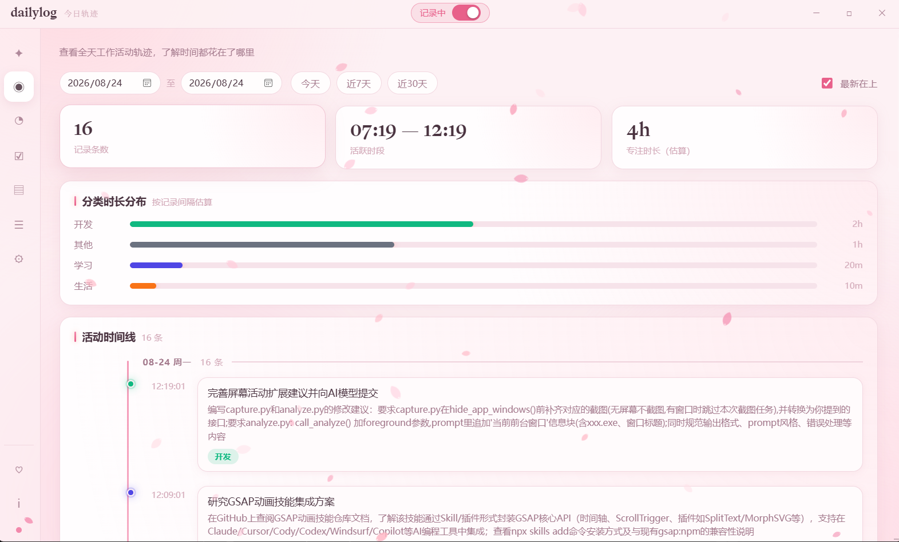
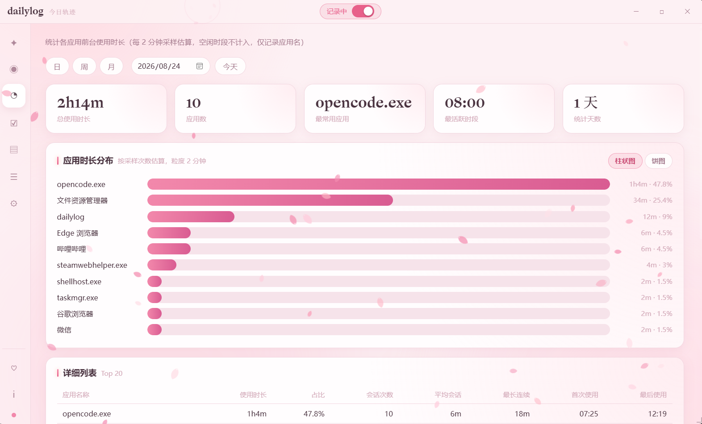
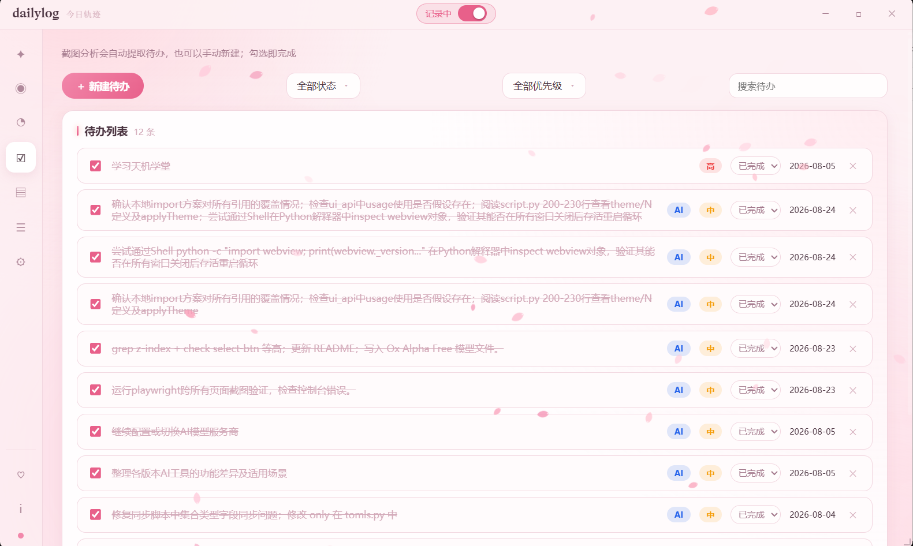
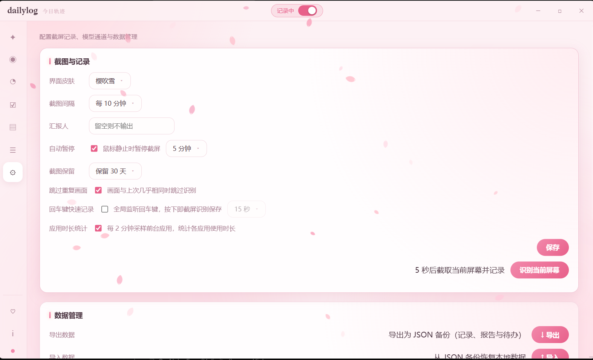

# dailylog · 今日轨迹

**简体中文** | [English](README.en.md)

<div align="center">




**自动记录一天的工作时间线，一键生成日报/周报。**

每 10 分钟截屏一次，由视觉模型把屏幕画面转成结构化工作记录，DeepSeek 再基于记录生成可交付的日报/周报。

[功能特性](#-功能特性) · [界面预览](#-界面预览) · [技术栈](#-技术栈) · [快速开始](#-快速开始) · [隐私设计](#-隐私设计)

</div>

## 📖 作者的话

这个工具是闲暇时随手开发的，用于测试 deepseek v4 最新模型。这只是一个小玩具，但是足以满足日常办公的记录和日报周报的总结。模型可以自己配置，不会的用 ai 帮你配，便宜好用的就行，不一定要跟作者一样选择这两个，作者选这两个主要是免费便宜。

在这里，作者唠叨两句，在下载任何一个项目时一定一定要审查代码安全。不要暴露自己的 key。

## ✨ 功能特性

- **自动记录**：Windows 任务计划程序每 10 分钟驱动一次截屏分析，无需常驻进程
- **智能跳过**：鼠标键盘静止（默认 ≥5 分钟）暂停、黑屏/睡眠跳过、画面去重（感知哈希比对，任务栏时钟/光标微动不触发重复分析）
- **手动截屏**：设置页按钮，5 秒倒计时后截取当前屏幕并记录；截屏瞬间自动隐藏应用自身窗口，界面不会进入截图
- **时间线浏览**：按日/周/月查看活动轨迹、分类时长分布、专注时长估算
- **应用时长统计**：前台进程采样，按日/周/月聚合各应用使用时长
- **待办管理**：从工作记录中提取待办，支持优先级与完成状态跟踪
- **一键报告**：基于时间线记录生成日报（成果导向模板）与周报（按项目归类），Markdown 直接可用
- **隐私设计**：截图即用即删、输出强制脱敏（见 [隐私设计](#-隐私设计)）
- **托盘常驻**：关闭窗口最小化到托盘，记录持续运行；打包为单文件 exe 后可全自动运行

## 🖼 界面预览

| 总览 | 活动线 |
|------|--------|
|  |  |

| 应用时长 | 待办 |
|----------|------|
|  |  |

| 设置 |
|------|
|  |

## 🛠 技术栈

| 层 | 技术 |
|----|------|
| 语言 | Python 3.10+ |
| 桌面 GUI | [pywebview](https://pywebview.flowrl.com/)（WebView2 无边框窗口）+ 原生 HTML/CSS/JS 前端 |
| 系统托盘 | pystray + pywin32 |
| 屏幕截取 | mss + Pillow |
| 空闲检测 | pywin32（GetLastInputInfo）+ pynput |
| LLM 调用 | requests → DashScope（视觉模型分析截图）+ DeepSeek（生成日报/周报） |
| 定时调度 | Windows 任务计划程序（schtasks） |
| 配置管理 | python-dotenv（`.env`）+ settings.json |
| 打包分发 | PyInstaller（onedir 模式） |

## 🚀 快速开始

### 环境要求

- Windows 10/11（任务计划 + mss 截屏 + GetLastInputInfo 均为 Windows 能力）
- Python 3.10+（开发验证环境 3.13）
- 两个 API Key（首次使用在应用设置页粘贴即可，见下）：
  - **阿里云百炼 DashScope**（截图分析，视觉模型）： <https://platform.aliyuncs.com>
  - **DeepSeek 官方**（日报/周报总结）：<https://platform.deepseek.com>

### 1. 安装依赖

```bash
pip install -r requirements.txt
```

### 2. 配置 API Key（推荐：设置页直接填）

打开应用 → **设置 → 模型服务**，粘贴两个 Key → **保存 Key** → 点 **测试连接** 验证。保存后立即生效（含定时任务），无需重启。

也可以手动编辑 `.env`：按 [.env.example](.env.example) 的键名填写（开发期放项目 `data\` 目录，打包版放在部署目录的 `dailylog-app\data\.env`）：

```
ANALYZE_API_KEY=你的DashScope Key
DEEPSEEK_API_KEY=sk-你的DeepSeekKey
```

### 3. 启动

```bash
python app.py
```

应用启动时会自动注册 Windows 定时任务 `DailyLogCapture`（每 10 分钟截屏记录一次，UI 可开关）。关闭窗口会最小化到托盘，记录持续运行。

### 命令行用法

| 用途 | 命令 |
|------|------|
| 桌面应用（推荐） | `python app.py` |
| 仅截屏记录（无界面，任务计划调用） | `pythonw core\capture.py` |
| 生成今天的日报 | `python core\summarize.py` |
| 生成某日日报 | `python core\summarize.py --day 2026-07-31` |
| 生成某周周报（该日期所在 ISO 周） | `python core\summarize.py --week 2026-07-31` |
| 打包版桌面应用 | `..\dailylog-app\dailylog.exe` |
| 打包版截屏记录 | `..\dailylog-app\dailylog.exe --capture` |
| 打包诊断（打印任务计划/配置状态） | `..\dailylog-app\dailylog.exe --diag` |

### 注册 Windows 定时任务（可选，应用启动时会自动注册）

```bash
# 开发期（pythonw 无控制台窗口；/f 覆盖已存在任务）
schtasks /create /tn DailyLogCapture /tr "\"<pythonw全路径>\" <项目绝对路径>\core\capture.py" /sc minute /mo 10 /f

# 打包后（部署在项目外 ..\dailylog-app\）
schtasks /create /tn DailyLogCapture /tr "\"C:\path\to\dailylog-app\dailylog.exe\" --capture" /sc minute /mo 10 /f

schtasks /run /tn DailyLogCapture    # 手动触发一次（冒烟测试）
schtasks /delete /tn DailyLogCapture /f   # 卸载
```

## ⚙️ 工作原理

```
┌──────────────────────────── 定时任务 DailyLogCapture（每 10 分钟） ────────────────────────────┐
│  core/capture.py：空闲检测 → mss 截屏 → 黑屏检测 → 去重 → 视觉模型分析 → 写时间线 → 删截图      │
└──────────────────────────────────────────────────────────────────────────────────────────────┘
        │ 写入
        ▼
  records/YYYY-MM-DD.md（人类可读时间线） + records/raw/YYYY-MM-DD.jsonl（结构化原始记录）
        │
        ▼ 手动触发（UI 按钮 / CLI）
  core/summarize.py：聚合记录 → DeepSeek → reports/日报-YYYY-MM-DD.md / 周报-YYYY-Www.md
```

## 🔧 设置项

通过应用「设置」页修改，持久化到 `settings.json`：

| 键 | 说明 | 可选值 | 默认 |
|----|------|--------|------|
| `interval_minutes` | 截屏间隔 | 5 / 10 / 15 / 30 / 60 | 10 |
| `recording_enabled` | 定时记录总开关（标题栏/托盘切换时持久化，启动时恢复） | true / false | true |
| `idle_enabled` | 鼠标静止时暂停截屏 | true / false | true |
| `idle_minutes` | 空闲阈值 | 1 / 2 / 5 / 10 / 15 / 20 / 30 | 5 |
| `report_name` | 日报"汇报人"，留空不输出该行 | 任意文本 | "" |
| `retention_days` | 本地记录保留天数，过期自动清理（0 = 永久保留） | 0 / 7 / 14 / 30 / 60 / 90 | 0 |
| `test_interval_seconds` | 测试用秒级截屏间隔（设置页改回分钟即清除，勿在生产使用） | 任意秒数 | 无 |

数据清理规则：`retention_days` 非 0 时，应用启动与每次截屏时检查（每天最多一次），删除日期早于窗口的 `records/` 记录与 `reports/` 日报/周报（周报按周日算边界，覆盖到窗口内不删）；文件名无法解析的报告不删。节流标记存 `.last_cleanup`。

手动截屏（设置页按钮）强制记录：跳过空闲检测与画面去重，适合开会、演示等需要记录的瞬间。所有截屏（定时与手动）在抓屏前自动隐藏应用窗口，保存后立即恢复。

## 📦 数据产物

### 时间线 `records/YYYY-MM-DD.md`

```markdown
# 2026-07-31 工作日志

## 09:10 · 开发
修复登录接口 token 过期处理 bug，涉及认证模块和请求拦截逻辑（VS Code）。
进展：本地验证通过，待提交 | 待办：补充超时重试的单元测试
```

### 原始记录 `records/raw/YYYY-MM-DD.jsonl`

每行一条 JSON：

```json
{"ts": "2026-07-31T09:10:00", "activity": "coding", "summary": "…",
 "detail": "…", "progress": "…", "todo": "…", "apps": ["VS Code"], "contains_sensitive": false}
```

- `activity` 分类：`coding`开发 / `writing`文档 / `meeting`会议 / `research`学习 / `communication`沟通 / `data`数据分析 / `support`运维 / `browsing`生活 / `idle`空闲 / `other`其他（[core/config.py](core/config.py) 可改标签）
- `contains_sensitive`：该条涉及敏感内容（已脱敏）

### 报告 `reports/`

- 日报：`日报-YYYY-MM-DD.md`（成果导向模板：核心成果 / 关键指标 / 重点事项 / 风险阻塞 / 明日三件事）
- 周报：`周报-YYYY-Www.md`（按项目/主题归类，附时间分布、遗留问题、下周建议）

## 🔒 隐私设计

1. **即用即删**：截图只在内存 → 临时文件 → API 分析过程中存在，分析完立即删除，磁盘不保留原始画面
2. **输出脱敏**：分析 prompt 强制模型输出时替换联系人身份、账号、密钥、完整链接等敏感字段，只保留脱敏后的工作事项
3. **边界说明**：截图明文会上传所选模型服务端，脱敏规则只约束"输出"不约束"输入"；若需输入侧保护需自行扩展本地模糊处理
4. 时间线记录仅保存在本机 dailylog 目录

## 💰 成本估算（含去重）

8h 工作 ≈ 48 次采样，去重后 15~25 条有效。费用与所选模型强相关：以 `core/config.py` 中配置的百炼模型单价实测。

## 📦 目录结构

<details>
<summary>展开查看</summary>

```
dailylog/
├── .env                    # 两个 API Key（用户自行填写，勿随包分发）
├── requirements.txt        # mss / requests / python-dotenv / pywebview / pywin32 / pystray / pillow / pynput
├── core/                   # 业务模块（内部一律 from core import X 绝对导入）
│   ├── config.py           # 全部可调参数集中（API、间隔、目录、分类标签）
│   ├── capture.py          # 截屏记录入口（任务计划调用，可直接运行）
│   ├── analyze.py          # 视觉模型调用（config.ANALYZE_MODEL 可换）+ 宽容 JSON 解析 + 分析 prompt
│   ├── summarize.py        # DeepSeek 日报/周报生成（CLI：--day / --week，可直接运行）
│   ├── usage.py            # 应用使用时长采集与聚合（可直接运行）
│   ├── todos.py            # 待办管理
│   └── llm.py              # 统一 LLM 调用通道
├── ui_api.py               # 桌面应用 API 桥：时间线/报告/设置/任务计划管理（纯 Python，可无 GUI 直测）
├── app.py                  # 桌面应用入口：pywebview 无边框窗口 + pystray 托盘
├── dailylog.spec           # PyInstaller 打包配置（onedir）
├── data/                   # 开发版运行数据：records/ reports/ .env settings.json 日志等
├── static/                 # 前端（index.html / style.css / script.js）
└── docs/                   # 文档与说明图（images/）

# 部署目录（项目外）：..\dailylog-app\
# └── dailylog.exe + _internal/   纯产物，不含任何数据
# 打包版运行数据：..\dailylog-app\data\（records/reports/.env/settings.json 等，构建时排除）
```

> **数据位置**：由 `core/config.py` 的 `DATA_DIR` 决定，统一是 BASE_DIR 下的 `data\` 子目录——开发版在项目 `data/`，打包版在部署目录的 `dailylog-app\data\`。

</details>

## 🧑‍💻 开发与打包

```bash
build.bat                 # 唯一入口：打包到临时目录再镜像部署到项目外 ..\dailylog-app
pyinstaller dailylog.spec # 注意：onedir 模式会清空重建输出目录！
```

**重要**：PyInstaller onedir 打包会**清空重建输出目录**。**务必使用 `build.bat`**（打包到临时 `dist_build/` 后镜像部署到项目外的 `..\dailylog-app`，robocopy `/XD data` 排除数据目录）。运行数据在部署目录的 `data\` 子目录里，构建不会伤到。

其他注意：

- 打包版数据（`.env`、`settings.json`、`records/`、`reports/`）在 `dailylog-app\data\`，不要把含密钥的 `.env` 随包分发
- 换部署位置时需同步三处：build.bat 的 `DEPLOY_DIR`、桌面快捷方式、任务计划 DailyLogCapture / DailyLogUsage 的 exe 路径
- 打包环境需额外安装 pyinstaller
- WebView2 数据目录固定在 `%LOCALAPPDATA%\dailylog\webview`（避免每次启动新建临时目录）；历史残留由应用启动时自动清理

## 🩺 故障排查

- **所有运行日志**：`dailylog.log`（1MB 轮转保留 3 份），在各自的 `data\` 目录下（开发版项目根、打包版 exe 同目录）
- **任务计划未生效**：设置页「当前状态」会显示"已停用"；用 `schtasks /query /tn DailyLogCapture` 检查
- **API 报错**：错误会带响应体前 300 字符写入日志，便于定位（如 400 模型名/Key 错误）
- **测试秒级记录**：设置页或 `apply_test_interval` 写入 `test_interval_seconds` 后，应用内自动进入测试循环（任务计划 schema 限制最小 1 分钟，秒级只能由应用进程驱动）
- **分析失败占位**：失败会写入"分析失败，下轮自动重试"占位条目，并标记重试状态——下个周期即使画面未变也会自动重试（避免连续失败时占位条目堆积）

## ⚠️ 已知限制

- 10 分钟粒度：空闲恢复最多延迟一个周期（不引入守护进程）
- 时长统计（专注时长、分类分布）按记录间隔**估算**，非精确计量
- 截屏明文上传云端：prompt 只防"输出"泄露，不防"输入"

## 📄 许可证

MIT

---

**简体中文** | [English](README.en.md)

